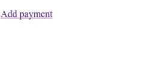
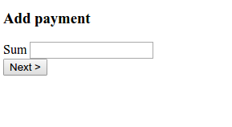
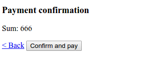

Example how to use RispoYandexKassaBundle in symfony 3 application
==================================================================
Example for https://github.com/AndreiBerezin/RispoYandexKassaBundle

How to use:
1) get composer
2) composer.phar install
3) fill parameters.yml with your yandexkassa parameters
4) php bin/console doctrine:database:create
5) php bin/console doctrine:schema:create
6) test payments :) 

Add payment -> confirm -> redirect to Yandex kassa -> pay from card -> return to application

